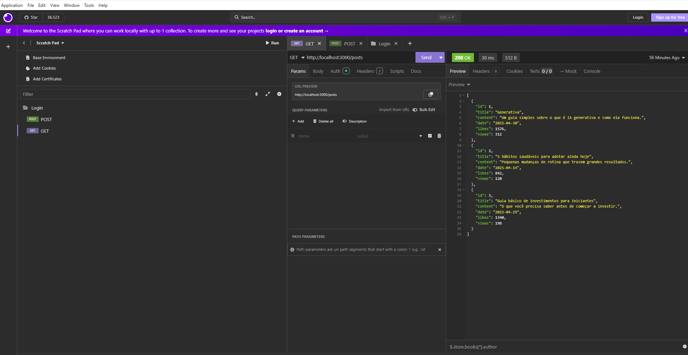
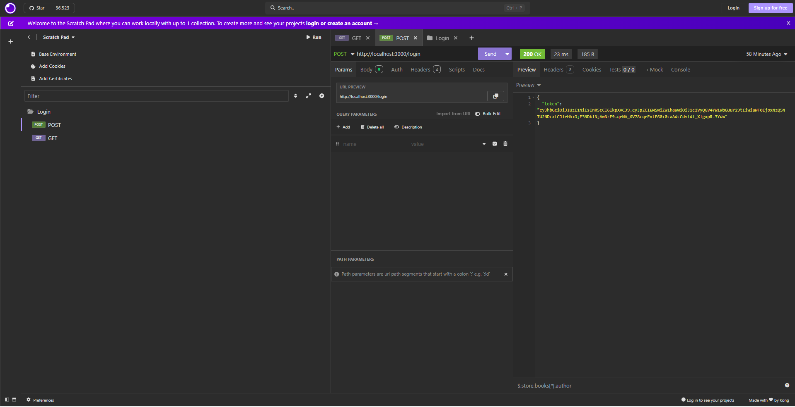

# Login - auth

# Integrantes do grupo: Rodrigo, Willian, Fernando e Mellyssa

Estrutura de autenticação para o projeto **Login**.
## Atividade em grupo de até 4 integrantes.
- Clonar este repositório.
- Testar a api com **insomnia**.
- Estudar e documentar a estrutura do projeto.
- Detalhar e documentar as bibliotecas utilizadas.
- Documentar descrição do funcionamento utilizando **UML DA(Diagrama de Atividades)**.

# Análise do Projeto Backend Node.js com Autenticação JWT

Este documento detalha a análise do projeto backend fornecido, que implementa um sistema básico de autenticação utilizando JSON Web Tokens (JWT). A análise abrange a estrutura do projeto, as bibliotecas empregadas, o funcionamento das rotas da API e o fluxo geral de operações ilustrado por um Diagrama de Atividades UML.

## Estrutura do Projeto

O projeto backend Node.js apresenta uma organização modular que visa separar as diferentes responsabilidades da aplicação. Na raiz do projeto, encontramos os arquivos de configuração essenciais e o ponto de entrada da aplicação. O arquivo `server.js` atua como o orquestrador principal, responsável por inicializar o servidor Express, configurar middlewares globais (como o `express.json()` para interpretar corpos de requisição JSON) e carregar os módulos de rotas. Arquivos como `package.json` e `package-lock.json` gerenciam as dependências e suas versões, garantindo a consistência do ambiente. O arquivo `.env` é crucial para armazenar variáveis de ambiente, como a chave secreta do JWT (`SECRET_JWT`), mantendo informações sensíveis fora do código-fonte.

O código-fonte da aplicação reside no diretório `src/`. Dentro dele, o subdiretório `routes/` contém os arquivos que definem os endpoints da API: `login.js` para a lógica de autenticação e `posts.js` para as operações relacionadas a posts (neste caso, apenas fornecendo dados estáticos). Adicionalmente, um diretório `middlewares/` abriga o arquivo `auth.js`, que implementa a lógica de verificação do token JWT para proteger rotas específicas. Essa estrutura promove uma separação clara de conceitos, facilitando a manutenção e a escalabilidade do código.

## Bibliotecas Utilizadas e Suas Funções

O projeto depende de um conjunto enxuto e eficaz de bibliotecas Node.js para sua funcionalidade:

*   **Express (`express`):** Como framework web principal, o Express fornece a estrutura para criar o servidor HTTP, gerenciar rotas e aplicar middlewares. Ele simplifica o tratamento de requisições e respostas, sendo a base sobre a qual a API é construída.
*   **Dotenv (`dotenv`):** Essencial para a segurança e configuração, o `dotenv` carrega variáveis de ambiente de um arquivo `.env` para `process.env`. Isso permite que segredos, como a chave JWT, sejam gerenciados fora do controle de versão, tornando a aplicação mais segura e adaptável a diferentes ambientes.
*   **JSON Web Token (`jsonwebtoken`):** Esta biblioteca é o coração do sistema de autenticação. Ela permite gerar tokens JWT assinados (`jwt.sign()`) na rota de login, após a validação das credenciais, e verificar a autenticidade e validade dos tokens (`jwt.verify()`) recebidos nas requisições para rotas protegidas, garantindo que apenas usuários autenticados possam acessá-las.

## Descrição das Rotas da API

A API expõe duas rotas principais que demonstram o fluxo de autenticação e acesso a dados:

*   **Rota de Autenticação (`POST /login`):** Este endpoint público é responsável por autenticar os usuários. Ele recebe um e-mail e senha no corpo da requisição. O sistema compara essas credenciais com valores fixos (hardcoded - uma prática insegura para produção). Se as credenciais forem válidas, um JWT é gerado usando `jsonwebtoken`, contendo informações básicas do usuário e um tempo de expiração. Este token é então retornado ao cliente em uma resposta JSON com status 200. Se as credenciais forem inválidas, uma resposta 401 Unauthorized é enviada.
*   **Rota de Posts (`GET /posts`):** Este endpoint representa um recurso protegido que exige autenticação. Antes de processar a requisição, o middleware `auth.js` é executado. Ele extrai o token JWT do cabeçalho `Authorization` (formato Bearer). O middleware verifica a presença e a validade do token usando `jsonwebtoken.verify()` e a chave secreta do `.env`. Se o token for válido e não expirado, a requisição prossegue, e o handler da rota retorna a lista estática de posts definida em `posts.js` com status 200. Caso contrário (token ausente, inválido ou expirado), o middleware interrompe o fluxo e retorna um erro (401 ou 500, dependendo do caso).

## Fluxo de Funcionamento (Diagrama de Atividades UML)

O fluxo de trabalho da API, abrangendo tanto o processo de login quanto o acesso a rotas protegidas, pode ser visualizado no Diagrama de Atividades UML abaixo. Ele ilustra as etapas sequenciais, as decisões baseadas na validação de credenciais e tokens, e as respostas correspondentes enviadas ao cliente.

Este diagrama oferece uma visão clara de como o middleware de autenticação atua como um portão para os recursos protegidos, garantindo que apenas requisições com tokens válidos possam prosseguir, enquanto a rota de login fornece o meio para obter esses tokens.

## Como Testar

Para testar a API localmente:

1.  Clone o repositório.
2.  Navegue até o diretório do projeto (onde `package.json` está localizado) via terminal.
3.  Entre na pasta api : `cd api`
4.  Instale as dependências: `npm install`
5.  Execute a aplicação com nodemon (para reiniciar automaticamente em caso de alterações): `npx nodemon server.js` 
6.  Utilize uma ferramenta como o Insomnia ou Postman para enviar requisições:
    *   **Login:** Envie uma requisição `POST` para `http://localhost:3000/login` com o corpo JSON: `{ "user": "usuario@gmail.com", "psw": "a1b2@b3c4" }`. Você deve receber um token JWT na resposta.
    *   **Posts:** Envie uma requisição `GET` para `http://localhost:3000/posts`. Sem autenticação, você receberá um erro 401. Para autenticar, adicione um cabeçalho `Authorization` com o valor `Bearer <seu_token_jwt>` (substitua `<seu_token_jwt>` pelo token recebido no login ). Com o token válido, você receberá a lista de posts.

    
    

